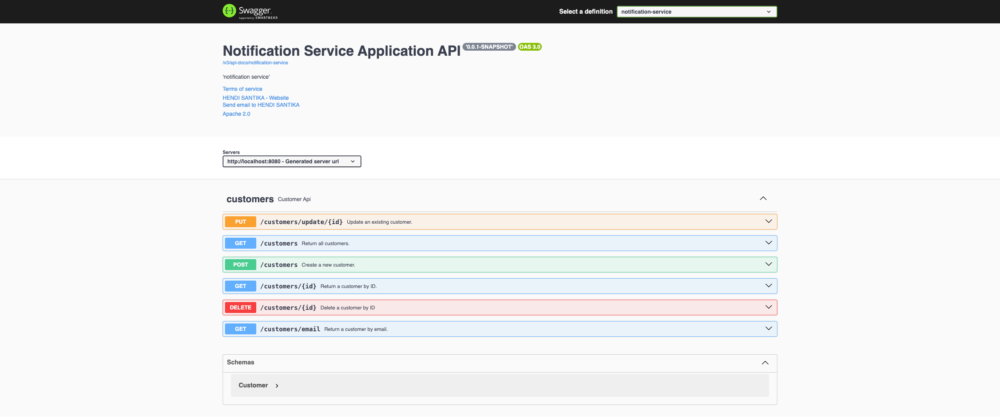

# notifier

Billing Notification System.

Notifier is responsible for notifying customers who their payment due date is the next day by sending email and sms.
To develop this application, I used Spring boot,Spring Data JPA to store and retrieve data in a relational database(
Postgresql).
I create a scheduled task named NotificationTask, also I used freemarker as a template engine to create the content of
messages
And then store messages in a queue (which in this case it is ActiveMQ) also It is also possible to replace MOM
with shared databases to do the process Async. For sending Emails I used JavaMailSender. I also expose some services via
rest.
In addition, I used Swagger for making documentation for our RESTful services.
On pointing your browser to http://localhost:8080/swagger-ui.html, you will see the generated documentation rendered by
Swagger UI.

### Image Screenshot

Swagger UI

